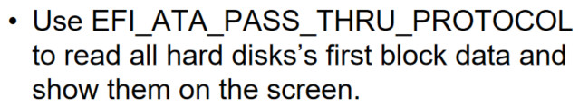
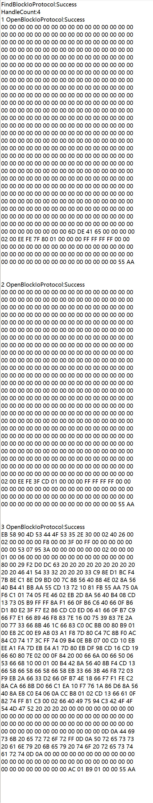
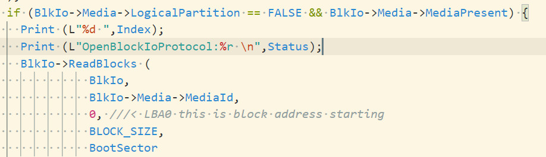
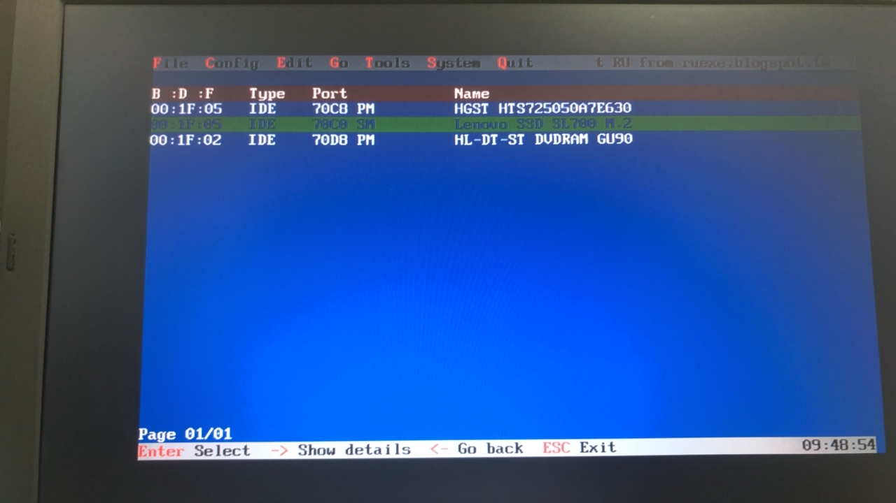
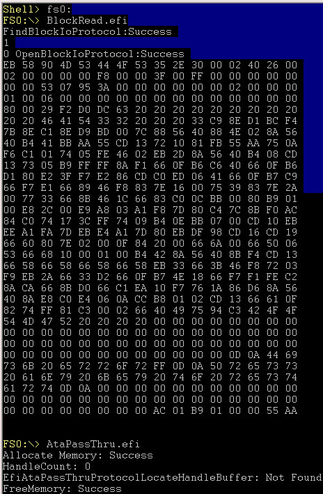
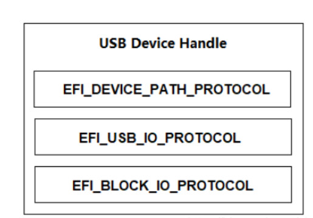
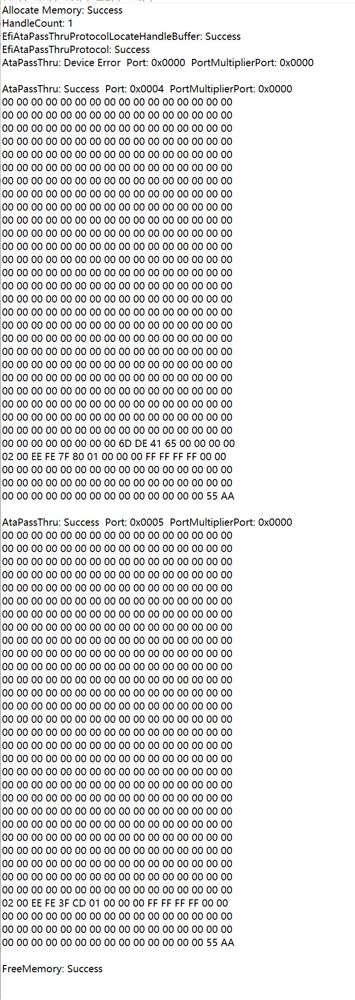
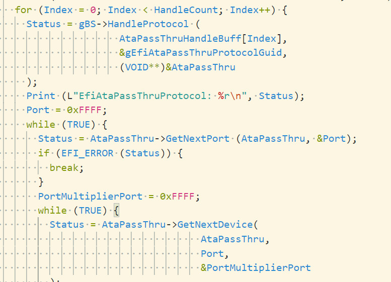

题目：

分别使用BlockIoProtocol与AtaPassThruProtocol,进行硬盘扇区的读写，测试机使用Minnow与Lenovo L440,

# 验证Lenovo L440 输出

## BlockIoProtocol

输出结果：

4数字为具有BlockIoProtocol所有设备的数目，我们只需要存储型的设备,不需要逻辑分区，筛选后,只有次序为1,2,3 Handle是存储设备。

上图为lenovo L440 RU读取的IDE Identify,一个HDD，一个SDD m.2,一个光驱，所以次序 1,2,3的Handle中没有光驱设备Handle，因为使用上面的代码过滤掉了没有存储介质的光驱设备，3个存储性设备除了硬盘的，多的一个Handle应该为UEFI Shell 启动盘设备Handle，使用minnow开发板进一步验证。

minnow开发板，存储设备只外插了优盘，如上图所示，可知Lenovo L440的BlocIoProtocol的Handle次序为3的是U盘的第一个扇区输出。

上网查找资料,可知USB设备装有Block IO Protocol

## AtaPassThruProtocol

我们可以发现在Lenovo L440 电脑中 AtaPassThruProtocol IDE mode 有两个Handle, AHCI mode 有一个 Handle,不知道为什么具有此现象?。

分别遍历每个Handle对应的具有AtaPassThruProtocol设备,发现只有第二handle对应了一个设备，与Lenovo L440的BlockIoProtocol输出内容做个对比可知，BlockIoProtocol handle 次序为2输出的内容，为Lenovo L440 中的日立硬盘设备。然而Minnow开发板上的U盘设备对应的控制器不使用AtaPassThruProtocol。

# 总结

Lenovo L440 BlockIoProtocol输出了handle次序为1,2,3的三个首扇区。Handle[2]为硬盘设备，Handle[3]为U盘设备，所以Handle[1]为SSD m.2设备。由AtaPassThruProtocol输出可知，在shell环境中，U盘设备支持BlockIoProtocol，不支持AtaPassThruProtocol，AtaPassThruProtocol，支持Ata和PAta设备。

综上可得 HDD硬盘与SDD输出的首扇区内容，经过Block Io Protocol验证可知，输出内容正确。

问题:可能因为有个硬盘是机械硬盘，当电脑开机首次运行读首扇区的efi，HDD设备会报Time out,再次运行efi文件，错误消失，增加了给读扇区的时间，首次运行任然报错。

后发现搞错了时间单位（以100ns为单位1），以为设置的是3秒，其实设置的是3ms,更改为3s后，首次读扇区也能读取出来，能肉眼可见的体会到机械硬盘的读取速度慢。

后续内容尝试去读取机械硬盘的Identify信息，然而在读取机械硬盘的Identify信息时却体会不到慢（秒出），说明所读取的机械硬盘的Identify信息不是去磁盘中读，可能是到内存中读取，可能Bios早已把Identify 信息存储内存的某个位置，在结合读取Identify的AtaPassThru的指令格式，没有指明去读的扇区，也验证了此猜想。

