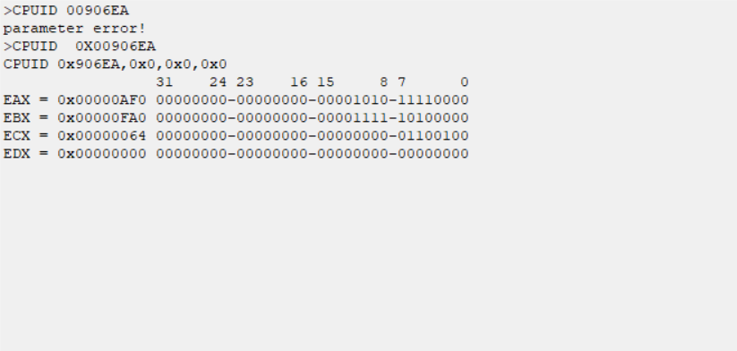

#CPU功能简介

##Basical Information 
- **CPU Frequency** 

  频率决定性能

- **TDP**

热设计功耗； CPU支持的最大功耗;

它用来标识CPU或者GPU被设计成需要被排出多少热量才能保证让其稳定工作在标称频率上。

- **Cache** 

CPU 缓存是一种快速且相对较小的内存，用于存储最近使用的工作内存数据。

在硬件上，我们将cache放置在CPU和主存之间，作为主存数据的缓存。 当CPU试图从主存中load/store数据的时候， CPU会首先从cache中查找对应地址的数据是否缓存在cache 中。如果其数据缓存在cache中，直接从cache中拿到数据并返回给CPU

**L1 cache分为单独的instruction cache（ICache）和data cache（DCache）。L1 cache是CPU私有的，每个CPU都有一个L1 cache。**

- **Processor Name / Family / Stepping**
- **CPUID / MSR**

**MSR（Model Specific Register）是x86架构中的概念，指的是在x86架构处理器中，一系列用于控制CPU运行、功能开关、调试、跟踪程序执行、监测CPU性能等方面的寄存器。**

**每个MSR寄存器都会有一个相应的ID，MSR Index（也叫做MSR寄存器地址）使用RDMSR和WRMSR两个指令的时候，提供MSR INdex就能让CPU知道MSR寄存器；**

**CPUID: 该指令用于指明具体的CPU芯片中，哪些功能是可用的，或者这些功能对应的MSR寄存器是否存在，软件可以通过CPUID指令查询某些功能是否在当前CPU上是否支持。**
##Basic information

**RW工具中COMMAND中的CPUID指令**

##Usual feature
- **Intel ®  Hyper-Threading Technology（超线程技术）**

英特尔超线程技术（英特尔 HT 技术）旨在提高 IA-32 处理器在多任务环境下执行多线程操作系统和应用程序代码或单线程应用程序的性能。 该技术使单个物理处理器能够使用共享的执行资源同时执行两个或多个独立的代码流（线程）

- **Multi-Core Technology**

多核技术是 IA-32 处理器系列中硬件多线程功能的另一种形式。 多核技术通过在一个物理封装中提供两个或多个执行核心来增强硬件多线程能力。

- **Intel ®  Virtualization Technology (Intel ®  VT)**

面向英特尔 64 位和 IA-32 架构的英特尔® 虚拟化技术提供支持虚拟化的扩展。 这些扩展称为虚拟机扩展 (VMX)。 带有 VMX 的 Intel 64 或 IA-32 平台可以用作多个虚拟系统（或虚拟机）。 每个虚拟机都可以在单独的分区中运行操作系统和应用程序。

**优点：**因为软件是独立于物理主机电脑的，用户可以在一片独立的硬件上运行多个系统示例，可以节省公司的时间，管理花费以及物理空间。

##Power Management （电源管理）
- **Processor power states (Cx)**

C0：只有在该状态下 CPU 才会执行指令

C1：也叫Halt，Latency必须短到OS使用CPU 的时候不会考虑到这个时间方 面的因素。除了CPU不执行指令外，没有其他软件可见的效果

C2：也叫Stop-Clock ，Latency由ACPI 固件提供，OS利用这个信息决定何时用C1取代C2 

C3： 也叫Sleep，处理器缓存保留了所有的状态信息，但是忽略所有的侦听。 OS负责保证缓存数据的一致性

- **Performance states (P States)**

当处理器运行 (C0) 时，它可以处于多种电源性能状态之一。 这些状态依赖于实现。 尽管如此，P0 始终是最高性能状态； P1 到 Pn 是连续的低性能状态，达到特定于实现的限制 n 不大于 16。

处理器P states是处理器在不同电压和/或频率级别下运行的能力。通常，P0是导致最大性能的最高状态，而P1、P2等将节省电能，但会对CPU性能造成一些损失。

- **Enhanced Intel® SpeedStep® (EIST)**

- **Intel® Turbo Boost Technology**

  **睿频技术，可以使cpu工作在高于额定主频模式来提升性能**

在睿频2.0中有四个功耗限制等级：

PL1：默频，可以长时间工作。

PL2：可以以高于默认频率较长时间工作（有时间限制并不是无限的）。

PL3：偶尔可以超过的值，不过超过了会马上强制缩回（也就是功率处于跳动状态）。

PL4：无论如何都不能超过的值 

##Thermal Management

- **Configurable TDP (cTDP)**

可配置 TDP 是下一代英特尔移动处理器的一种操作模式，允许调整其 TDP 值。 通过修改处理器行为及其性能级别，可以同时改变处理器的 TDP 来改变其功耗。 这样，处理器可以在更高或更低的性能水平下运行，具体取决于可用的冷却能力和所需的功耗

Nominal TDP – 这是处理器的额定频率和 TDP

cTDP down  当需要更冷或更安静的操作模式时，与Nominal TDP 相比，此模式指定较低的 TDP 和较低的保证频率。

cTDP up   当额外的冷却可用时，此模式与标称模式相比指定更高的 TDP 和更高的保证频率。

- **CPU throttling states (T states)**

T 状态是指将处理器时钟节流到较低频率以减少热效应。 这意味着 CPU 被迫每秒闲置固定百分比的周期。 节流状态范围从 T1（CPU 没有强制空闲周期）到 Tn，空闲周期的百分比增加，n 越大。

请注意，节流不会降低电压，并且由于 CPU 被迫在部分时间处于空闲状态，因此进程将需要更长的时间才能完成，并且会消耗更多电量而不是节省任何电量。

T 状态仅在减少热效应是主要目标时才有用。 由于 T 状态会干扰 C 状态（阻止 CPU 达到更高的 C 状态），因此它们甚至会增加具有 C 状态的现代 CPU 的功耗。

- **Digital Thermal Sensors (DTS)**

