 
#第十二课 ATA training_Winddy

##introduction 

硬盘接口是硬盘与主机系统间的连接部件，作用是在硬盘缓存和主机内存之间传输数据。不同的硬盘接口决定着硬盘与计算机之间的连接速度，在整个系统中，硬盘接口的优劣直接影响着程序运行快慢和系统性能好坏.

硬盘接口类型可分为IDE、SATA、SCSI 、SAS和光纤通道五种。
## Definitions
###	AT
IBM个人计算机AT，通常被称为IBM AT，有时也称为PC AT或PC / AT，是IBM的第二代PC，围绕6 MHz Intel 80286微处理器设计，并于1984年作为系统单元5170发行。 之所以将AT命名为“Advanced Technology”，是因为AT提供了当时个人计算机中新出现的各种技术； 其中一项进步是80286处理器支持保护模式。
###PATA
Parallel ATA（PATA），原为AT Attachment，是计算机中连接硬盘驱动器、软盘驱动器、光驱等存储设备的接口标准。

数据线80针；

电源线 4针；

IDE 模式下支持两个CHANNEL,每个channel可以支持两个设备，一个是master 一个Slave

###ATAPI
ATAPI 是一种允许 ATA 接口承载 SCSI 命令和响应的协议。 ATAPI 设备包括 CD-ROM 和 DVD-ROM 驱动器、磁带驱动器和大容量软盘驱动器，例如 Zip 驱动器、磁光驱动器和 SuperDisk 驱动器

### IDE  
IDE的英文全称为“Integrated Drive Electronics”，即“电子集成驱动器“，或者叫“集成设备电路“。它的本意是指把“硬盘控制器“与“盘体“集成在一起的硬盘驱动器。IDE是一种磁盘驱动器接口类型，硬盘和光驱通过IDE接口与主板连接。控制器电路就驻留在驱动器中，不再需要单独的适配器卡。

IDE代表着硬盘的一种类型，人们也习惯用IDE来称呼最早出现IDE类型硬盘ATA-1，这种类型的接口随着接口技术的发展已经被淘汰了，而其后发展分支出更多类型的硬盘接口，比如ATA、Ultra ATA、DMA、Ultra DMA等接口都属于IDE硬盘。

特点：

- 价格低廉
- 兼容性强
- 性价比高
- 数据传输慢
- 不支持热插拔等

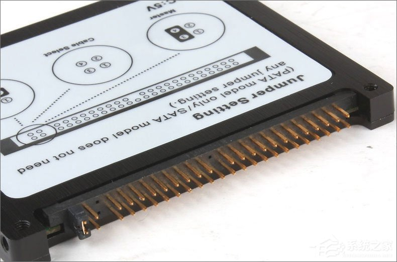
###ATA Packet Interface (ATAPI)

ATAPI 是一种允许 ATA 接口承载 SCSI 命令和响应的协议。 ATAPI 设备包括 CD-ROM 和 DVD-ROM 驱动器、磁带驱动器和大容量软盘驱动器，例如 Zip 驱动器、磁光驱动器和 SuperDisk 驱动器

###SATA (Serial ATA )
SATA硬盘，即SATA（Serial ATA）又被称为串口硬盘。SATA采用差分信号系统，该系统能有效将噪声滤除，因此SATA就不需要使用高电压传输去抑制噪声，只需要使用低电压操作即可。

在数据传输这一方面，SATA的速度比PATA更加快捷，并支持热插拔。另一方面，SATA总线使用了嵌入式时钟频率信号，具备了比以往更强的纠错能力，能对传输指令（不仅是数据）进行检查，如果发现错误会自动矫正，提高了数据传输的可靠性。

 Serial ATA 以连续串行的方式传送数据，一次只会传送 1 位数据。这样能减少 SATA 接口的针脚数目，使连接电缆数目变少，效率也会更高。实际上， Serial ATA  仅用四支针脚就能完成所有的工作，分别用于连接电缆、连接地线、发送数据和接收数据，同时这样的架构还能降低系统能耗和减小系统复杂性

|SATA版本|带宽|速度|
|---|---|---|
|SATA1.0|1GB/S|150MB/S|
|SATA2.0|3GB/S|300MB/S|
|SATA3.0|6GB/S|600MB/S|

##IDE MODE (compatible)
如何找到一个SATA controller?   =>  **PCI class code**

  

 **Class code**

类别码（Offset 09h~0Bh）

	09h   0AH              0BH
	      01（IDE mode）	   01(存储类设备)  (09h 有两bit决定IDE工作在compatible mode 或者 native mode  )
	01	  06(AHCI mode)     01
		  04(read mode)
		  08( NVME)

它是一个24位只读的缓存器，他被分成三个字段：基本类别（base Class),子类别（Sub Class),程序接口（Programming Interface）

* 较高字节定义功能的基本类别
* 中间的字节定义在基本类别的子类别
* 较低的位元组定义程序接口

**Base Class**

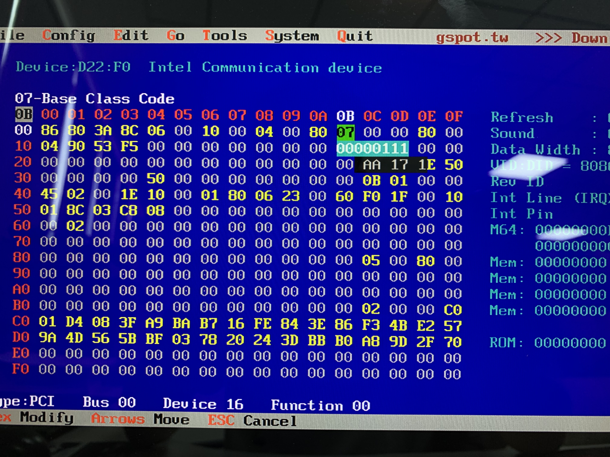
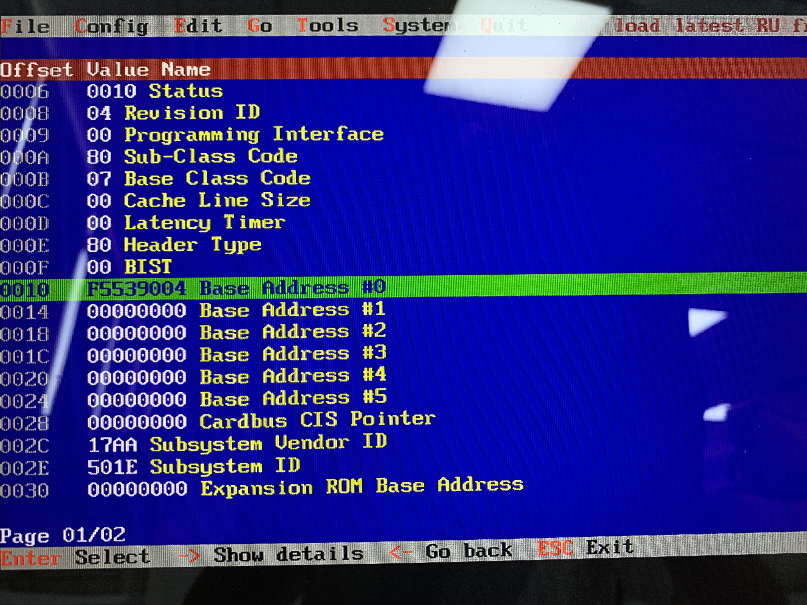

 **09h寄存器的描述** 

* bit 1 bit 3 用来表示IDE 控制器是否支持native mode
 
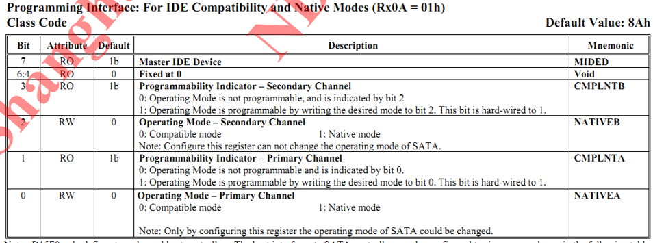

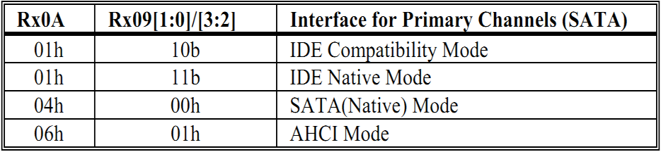 

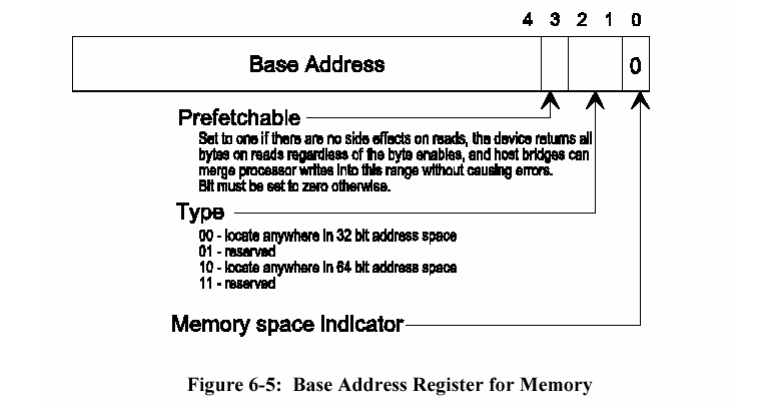

**BIT0位置1时，才能对BAR中的I/O space 解码，进行相应的操作；**

**IDE mode requests 5 I/O port**

2 for Primary Channel, another 2 for Secondary Channel and 1 for IDE Bus Master

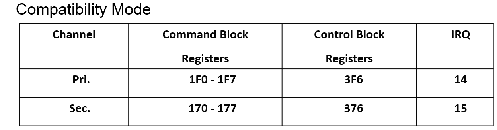
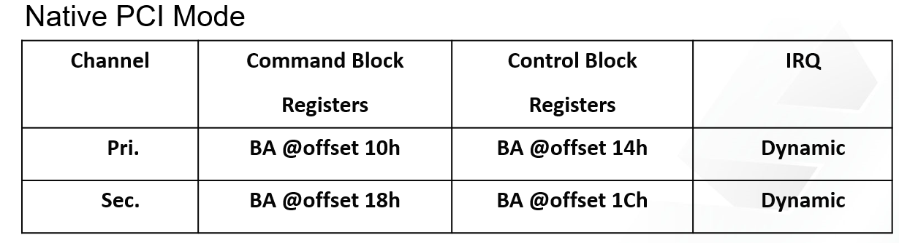 

* **ATA COMMAND BLOCK**

**ATA接口寄存器可分为命令块寄存器和控制块寄存器。**

（1）命令块寄存器是主机用来向设备传输命令或从设备读取状态的，这组寄存器包括：

**柱面号高（Cylinder High）8位寄存器：**

**柱面号低（Cylinder Low）8位寄存器：**

**设备/磁头（Device/Head）寄存器：**
指定硬盘驱动器号与磁头号和寻址方式，其中第4位的内容指定的是设备号，当为0时选即主设备，为1时选择从设备

**扇区数（Sector Count）寄存器：**指明所要读写的扇区总数，其中0表示传输256个扇区，如果在数据读写过程发生错误，寄存器将保存尚未读写的扇区数目。

扇区号寄存器、柱面号寄存器、设备/磁头寄存器三者合称为介质地址寄存器。介质地址有CHS方式或LBA方式，而采用何种方式是在设备磁头寄存器中指定。

**扇区号（Sector Number）寄存器：**指定所要读/写的起始扇区号。

**命令（Command）寄存器:**包含执行的命令代码。在向命令寄存器写命令以前，相关该命令的参数必须先写入。

**状态（Status）寄存器**
保存设备执行命令后的状态和结果，寄存器各位所表示的内容如表所示。
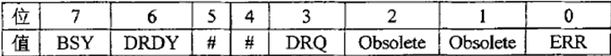
**BSY 位:** 为1时表示设备忙，正在执行命令。主机在发送命令前必须
先判断该位是否为0;

**DRDY 位 :**为1时表示设备准备好，可以接收命令;

**DRQ 位:** 为1表示请求主机进行数据传输(读或写);

**ERR位 :** 该位为1表示在结束前次的命令执行时发生了无法恢复的错误，在错误寄存器中保存了更多的错误信息;#位表示该位的内容随命令的不同而不同，Obsolete位表示该位不使用

**特征（Features）寄存器:**此寄存器中的内容在命令被执行时作为命令参数，只有在BSY和DRQ都为零且DMACK无效时该寄存器才能被写入。

**错误（Error）寄存器：**该寄存器包含了本次命令执行后设备的诊断信息。在启动系统、设备复位或执行设备的诊断程序后，也在该寄存器中保存着一个诊断码。

**数据（Data）寄存器：**是主机和设备的缓冲区之间进行数据交换用的寄存器，使用该寄存器进行数据传输的方式是PIO传输方式，数据交换的另外两种方式是MDMA和UDMA方式，这两种方式不使用数据寄存器进行数据交换。
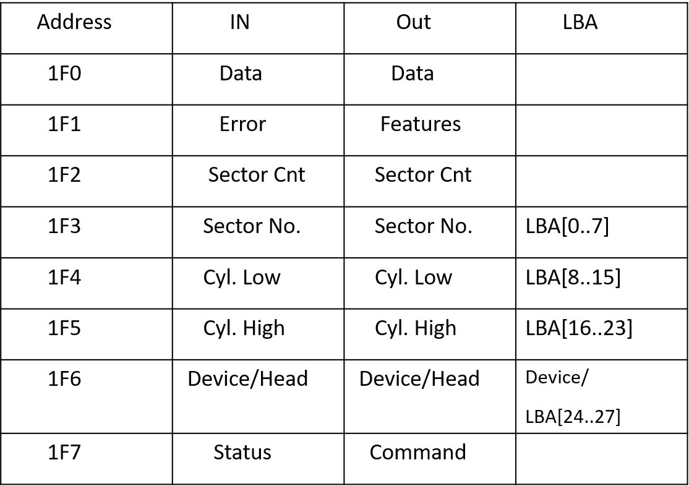
（2）控制块寄存器是用来控制设备和替换状态，这组寄存器包括：

**设备控制（Device Control）寄存器:**将该寄存器的SRST位设置为1，可以使设备处于复位状态。nIEN表示是否允许中断，0为允许，设备可以发送INTRQ信号。由此可见，对该寄存器发送04H命令即命令设备硬复位，其格式如表所示，其中r表示该位保留。
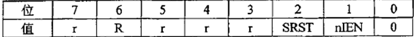

替换状态（Alternate Status）寄存器

驱动器地址（Drive Address）寄存器

**结构体**

 **ATA_IDENTIFY_DATA** 

硬盘接到系统上，ATA_IDENTIFY_DATA 存放 硬盘序列号 厂商信息 大小 ，通过接口下命令得到返回信息，从而得到基本信息；
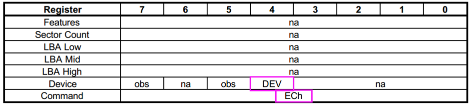

**一个channel上可以连接Master和slave 设备，所以device有DEV选项。DEV(第四位)0表示发往Master 1 表示发往Slave**

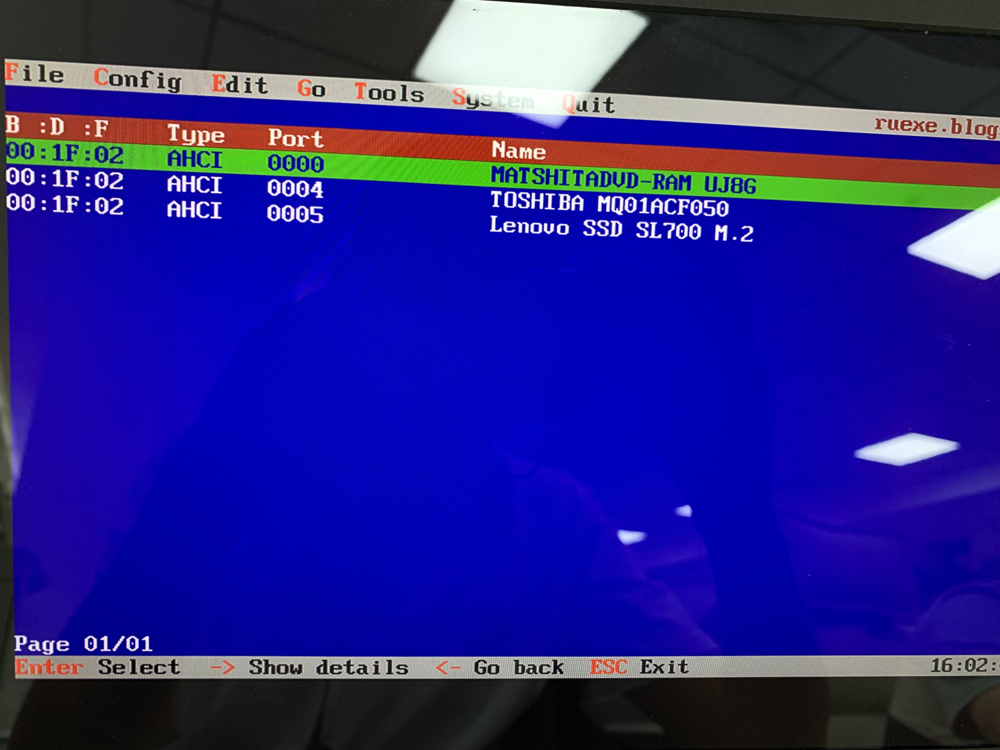

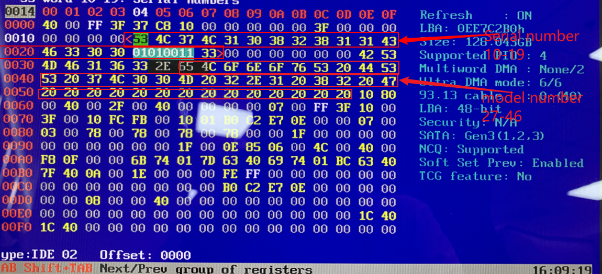
 **READ SECTOR(S)** 

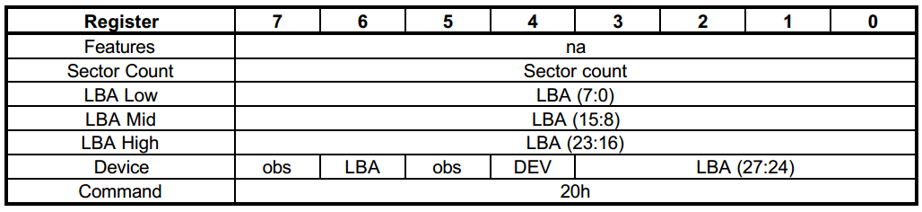

##AHCI

* 高级主机控制器接口 (AHCI) 是 Intel 定义的技术标准，它以非特定于实现的方式指定串行 ATA (SATA) 主机总线适配器的操作
* 该规范描述了计算机硬件供应商在主机系统内存和附加存储设备之间交换数据的系统内存结构
* AHCI 为软件开发人员和硬件设计人员提供了一种检测、配置和编程 SATA/AHCI 适配器的标准方法
* AHCI 与 SATA 3 Gbit/s 标准是分开的，尽管它公开了 SATA 的高级功能（例如热插拔和本机命令队列），以便主机系统可以利用它们

###How to find it in PCI list?

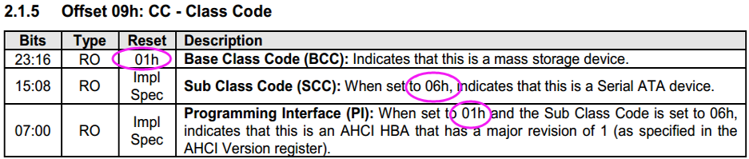

## SATA protocol stack 

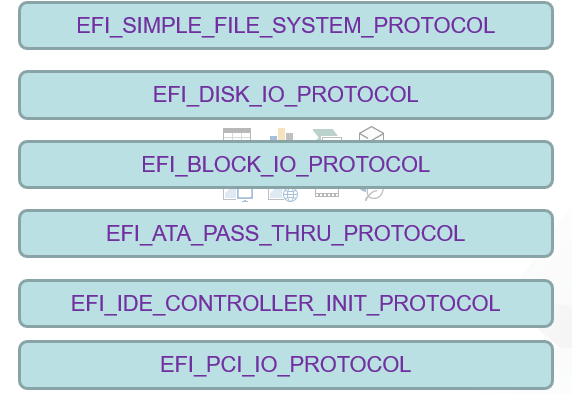

## EFI_ATA_PASS_THRU_PROTOCOL
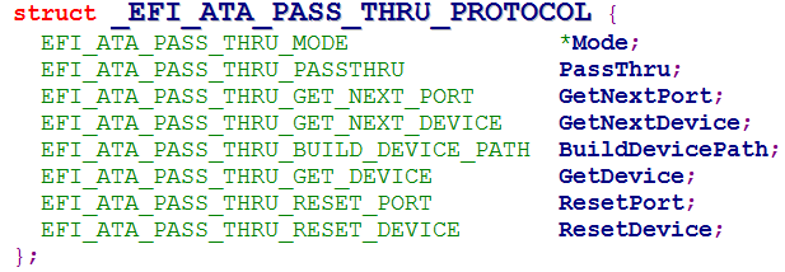

